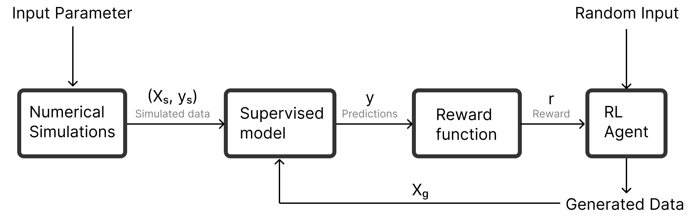
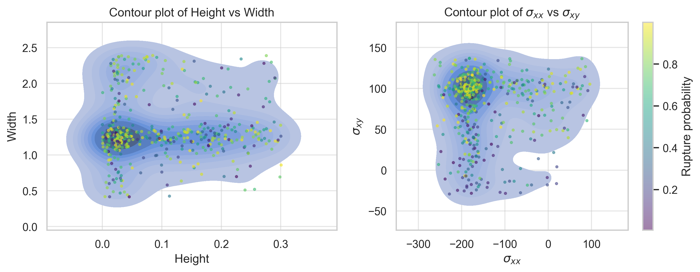
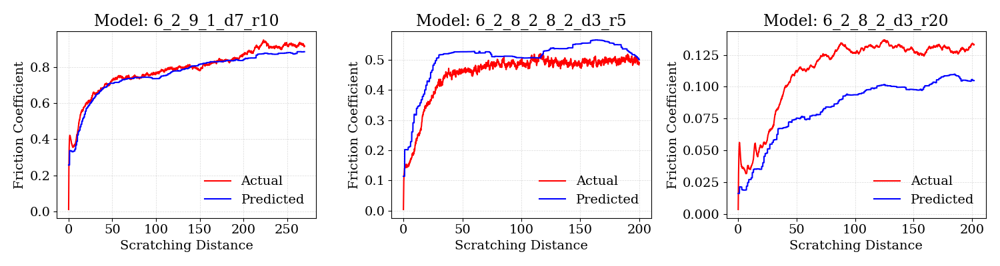

<!-- Create an README for this repo -->
  Certainly! Here's a possible README.md file for the Earthquake_rupture_data_generation repository:

### Earthquake Rupture Data Generation
This repository contains code for generating synthetic earthquake rupture data, as well as scripts and tools for working with and visualizing the generated data. The code is written in Python and is designed to be easily customizable and extensible.

#### Abstract
We introduce a new machine learning framework designed to help researchers who relys on simulations to study physical systems or processes. High computational costs and the resulting limited data often pose significant challenges to gaining insights into these systems or processes. In this innovative approach, we first train a supervised predictive model using a small-scale simulated dataset with varying input parameters. Subsequently, a deep learning generator is developed using the same data points. The final step involves training a reinforcement learning agent that employs the supervised model and generator to produce more accurate, simulation-like data. By leveraging this framework, researchers can generate more accurate data and know the outcomes without running high computational simulations. Which enabls them to explore the parameter space more efficiently and gain deeper insights into physical systems or processes. In this paper, we demonstrate the effectiveness of the proposed framework by applying it to two case studies in material science and geodynamics. We also discuss the potential applications of this framework in other fields, such as fluid dynamics, climate modeling, and drug discovery.

### Getting Started
To get started with using this code, you will need to have Python 3.x installed on your system, along with several Python packages listed in the requirements.txt file. You can install these packages using the following command:

### Required libraries
Once you have the necessary packages installed, you can generate synthetic earthquake rupture data using the generate_data.py script. This script takes several parameters, including the number of ruptures to generate, the dimensions of the rupture area, and the magnitude range of the ruptures. For example, to generate 100 ruptures with dimensions of 100 x 100 km and magnitudes between 6.0 and 8.0, you can run the following command:

### Data
python plot_data.py data/rupture_0.csv
This will generate a plot of the rupture area and magnitude, which will be saved in the plots directory.

### Example Results
The following schematic diagram shows the framework: 

The Plot below shows the contour of the rupture outcome using generated data from RL Agent (a) height and width (b) normal and shear stress

The plot below shows the predicted frictional coefficient along the scratching distance for the test data on different models.

### Contributing
If you would like to contribute to this project, please feel free to submit pull requests or issue reports. We welcome contributions of all kinds, including bug fixes, new features, and documentation improvements.

### License
This code is licensed under the MIT License. See the LICENSE file for details.

### References:
- [Deep Q-Learning with Keras and Gym](https://keon.io/deep-q-learning/)
- [Double Deep Q Networks](https://towardsdatascience.com/double-deep-q-networks-905dd8325412)
- [Using Keras and Deep Deterministic Policy Gradient to play TORCS](https://yanpanlau.github.io/2016/10/11/Torcs-Keras.html)
- [Practical Deep Reinforcement Learning Approach for Stock Trading](https://arxiv.org/abs/1811.07522)
- [Introduction to Learning to Trade with Reinforcement Learning](http://www.wildml.com/)
- [Adversarial Deep Reinforcement Learning in Portfolio Management](https://arxiv.org/abs/1808.09940)
- [A Deep Reinforcement Learning Framework for the Financial Portfolio Management Problem](https://arxiv.org/abs/1706.10059)
